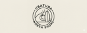

	

 

	
    
    
    
    
	

### :sparkles: Colaboradores
<table>
  <tr>
    <td align="center"><a href="https://github.com/informaticalivreoficial">
        
     <b>Renato Montanari</b></a></td>    
  </tr>  
</table>