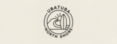

<p align="center">
  <a href="http://ubatubanorthshore.com.br" target="_blank">
    
  </a>
</p>

<h1 align="center">🏖️ Ubatuba North Shore</h1>
<h3 align="center">Sistema completo de locação de imóveis por temporada</h3>

<br>

<p align="center">
  
  
  
  
  
  
</p>

<br>

---

## 📋 Sobre o Projeto

O **Ubatuba North Shore** é uma plataforma moderna de locação de imóveis por temporada, desenvolvida para oferecer uma experiência fluida tanto para hóspedes quanto para administradores. O sistema conta com reservas online, pagamentos integrados via Mercado Pago (cartão e PIX), painel administrativo completo e notificações automáticas.

---

## ✨ Funcionalidades

- 🏠 **Catálogo de imóveis** com fotos, descrições e disponibilidade em tempo real
- 📅 **Calendário de reservas** com bloqueio automático de datas
- 💳 **Pagamento online** via cartão de crédito, débito e PIX (Mercado Pago)
- 📱 **QR Code PIX** gerado automaticamente com expiração configurável
- 🔔 **Notificações automáticas** por e-mail e banco de dados
- 🪝 **Webhook do Mercado Pago** para confirmação assíncrona de pagamentos
- 👥 **Gestão de hóspedes** com cadastro de CPF e data de nascimento
- 📊 **Painel administrativo** com controle de reservas, imóveis e configurações
- 🍪 **Gestão de cookies** com preferências do usuário (LGPD)
- 📧 **E-mails transacionais** com templates personalizados

---

## 🛠️ Tecnologias

| Tecnologia | Versão | Uso |
|---|---|---|
| PHP | 8.3+ | Linguagem base |
| Laravel | 10.x | Framework principal |
| Livewire | 3.x | Componentes reativos |
| Alpine.js | 3.x | Interatividade no frontend |
| TailwindCSS | 3.x | Estilização |
| Mercado Pago SDK | latest | Gateway de pagamento |
| IMask.js | latest | Máscaras de input |
| Flatpickr | latest | Datepicker |
| Toastify | latest | Notificações toast |
| SweetAlert2 | latest | Modais de confirmação |
| Laravel Sail | latest | Ambiente Docker |

---

## 🚀 Instalação

### Pré-requisitos

- Docker e Docker Compose
- PHP 8.3+
- Composer

### Passo a passo

**1. Clone o repositório**
```bash
git clone https://github.com/informaticalivreoficial/ubatubanorthshore.git
cd ubatubanorthshore
```

**2. Instale as dependências**
```bash
composer install
npm install
```

**3. Configure o ambiente**
```bash
cp .env.example .env
php artisan key:generate
```

**4. Configure o `.env`**
```env
APP_NAME="Sua Aplicação"
APP_URL=http://localhost

DB_CONNECTION=mysql
DB_HOST=mysql
DB_PORT=3306
DB_DATABASE=bancodedados
DB_USERNAME=sail
DB_PASSWORD=password

MAIL_MAILER=smtp
MAIL_HOST=mailpit
MAIL_PORT=1025
MAIL_USERNAME=null
MAIL_PASSWORD=null
MAIL_ENCRYPTION=null
MAIL_FROM_ADDRESS="no-reply@localhost"
MAIL_FROM_NAME="${APP_NAME}"

MERCADOPAGO_KEY=sua_public_key
MERCADOPAGO_TOKEN=seu_access_token
MERCADOPAGO_WEBHOOK_SECRET=seu_webhook_secret
```

**5. Suba o ambiente com Sail**
```bash
./vendor/bin/sail up -d
```

**6. Execute as migrations e seeders**
```bash
./vendor/bin/sail artisan migrate --seed
```

**7. Compile os assets**
```bash
npm run dev
```

Acesse: [http://localhost](http://localhost)

---

## 💳 Configuração do Mercado Pago

1. Crie uma conta em [mercadopago.com.br](https://mercadopago.com.br)
2. Acesse **Seu negócio → Configurações → Credenciais**
3. Copie a **Public Key** e o **Access Token** para o `.env`
4. Configure o webhook em **Seu negócio → Webhooks**:
   - URL: `https://seudominio.com/api/webhook/mercadopago`
   - Eventos: **Pagamentos**
5. Copie o **Webhook Secret** para o `.env`

---

## 📁 Estrutura do Projeto

```
app/
├── Http/
│   ├── Controllers/
│   │   ├── Api/          # Controllers da API
│   │   └── Web/          # Controllers web + Webhook MP
│   └── Livewire/         # Componentes Livewire
├── Models/               # Eloquent Models
├── Notifications/        # Notificações (email + banco)
└── Traits/               # Traits reutilizáveis (WithToastr, etc.)

resources/
├── views/
│   ├── emails/           # Templates de e-mail
│   ├── livewire/         # Views dos componentes
│   └── web/              # Views públicas
```

---

## 🔔 Sistema de Notificações

O sistema dispara notificações automáticas para administradores nos seguintes eventos:

| Evento | E-mail | Banco |
|---|---|---|
| Nova reserva criada | ✅ | ✅ |
| Pagamento confirmado | ✅ | ✅ |

---

## 🤝 Colaboradores

<table>
  <tr>
    <td align="center">
      <a href="https://github.com/informaticalivreoficial">
        
        <br />
        <sub><b>Renato Montanari</b></sub>
      </a>
    </td>
  </tr>
</table>

---

## 📄 Licença

Este projeto está sob a licença MIT. Veja o arquivo [LICENSE](LICENSE) para mais detalhes.

---

<p align="center">
  Feito com ❤️ por <a href="https://github.com/informaticalivreoficial">Renato Montanari</a>
</p>